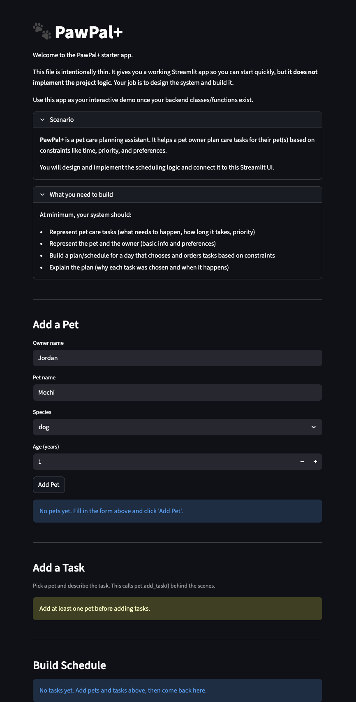

# PawPal+ (Module 2 Project)

You are building **PawPal+**, a Streamlit app that helps a pet owner plan care tasks for their pet.

## Scenario

A busy pet owner needs help staying consistent with pet care. They want an assistant that can:

- Track pet care tasks (walks, feeding, meds, enrichment, grooming, etc.)
- Consider constraints (time available, priority, owner preferences)
- Produce a daily plan and explain why it chose that plan

Your job is to design the system first (UML), then implement the logic in Python, then connect it to the Streamlit UI.

## 📸 Demo

<a href="pawpal_app.png" target="_blank"></a>

---

## Features

### Pet & owner management
- Register multiple pets under one owner profile (name, species, age)
- Remove pets at any time; their tasks are cleaned up automatically

### Task management
- Add care tasks to any pet: **walk**, **feeding**, **medication**, or **appointment**
- Set a due time and recurrence frequency: **once**, **daily**, or **weekly**
- Priority is inferred automatically from the category — no manual input needed:
  - `medication` / `appointment` → **HIGH**
  - `feeding` → **MEDIUM**
  - `walk` → **LOW**

### Sorting
- **Sort by time** — tasks appear in ascending `due_time` order (chronological daily schedule)
- **Sort by priority** — HIGH tasks float to the top; `due_time` is used as a tie-breaker within each priority tier

### Conflict detection
- Scans every pair of incomplete tasks and flags any two scheduled within **30 minutes** of each other
- Warnings appear at the top of the schedule with the exact gap in minutes and which pet(s) are affected
- Returns an empty list (no exception) when the schedule is clean

### Overdue task warnings
- Any pending task whose `due_time` has already passed is highlighted with `st.warning` in the UI
- Overdue detection uses `datetime.now()` at render time so it stays current as the day progresses

### Recurring task automation
- Marking a task complete auto-schedules the next occurrence via Python's `timedelta`:
  - **Daily** → `due_time + 1 day`
  - **Weekly** → `due_time + 7 days`
  - **One-time** → no new task is created
- The next occurrence is a fresh `Task` object (cloned via `dataclasses.replace()`); the completed task is never mutated

### Filtering
- Filter the schedule to a single pet or view all pets at once
- Separate views for **pending** and **completed** tasks

---

## What you will build

Your final app should:

- Let a user enter basic owner + pet info
- Let a user add/edit tasks (duration + priority at minimum)
- Generate a daily schedule/plan based on constraints and priorities
- Display the plan clearly (and ideally explain the reasoning)
- Include tests for the most important scheduling behaviors

## Smarter Scheduling

The `Scheduler` class in `pawpal_system.py` goes beyond a simple task list with four algorithmic features:

### Sort by time
`sort_by_time()` uses Python's `sorted()` with a `lambda` key to order every task across all pets by `due_time` in ascending order, so the daily schedule always reads chronologically regardless of the order tasks were added.

### Filter tasks
`filter_tasks(pet_name, status, category)` applies AND logic across up to three dimensions — you can ask for "Rex's pending medication tasks" in a single call. It reuses the same sorted output as `sort_by_time()` so results are always in chronological order.

### Recurring task automation
`mark_task_complete(task)` marks a task done and immediately schedules the next occurrence using Python's `timedelta`:
- **Daily** tasks → `due_time + timedelta(days=1)`
- **Weekly** tasks → `due_time + timedelta(weeks=1)`
- **One-time** tasks → no new task is created

The next-occurrence `Task` is cloned with `dataclasses.replace()` so the original is never mutated, then added to the same pet automatically.

### Conflict detection
`get_conflict_warnings(window_minutes=30)` scans every pair of incomplete tasks and flags any two whose `due_time` falls within the configurable window (default 30 minutes). It returns plain-English strings such as `"'Walk' (08:00 AM) and 'Medication' (08:15 AM) are only 15 min apart (same pet (Rex))"`. Exact-time overlaps are called out explicitly as `"exact overlap!"`. The lower-level `check_for_conflicts(window_minutes)` returns raw `(Task, Task)` pairs for programmatic use. Neither method raises an exception — both return an empty list when the schedule is clean.

## Getting started

### Setup

```bash
python -m venv .venv
source .venv/bin/activate  # Windows: .venv\Scripts\activate
pip install -r requirements.txt
```

### Suggested workflow

1. Read the scenario carefully and identify requirements and edge cases.
2. Draft a UML diagram (classes, attributes, methods, relationships).
3. Convert UML into Python class stubs (no logic yet).
4. Implement scheduling logic in small increments.
5. Add tests to verify key behaviors.
6. Connect your logic to the Streamlit UI in `app.py`.
7. Refine UML so it matches what you actually built.

## Testing PawPal+

### Running the test suite

```bash
python -m pytest tests/test_pawpal.py -v
```

### What the tests cover

| Test | Behavior verified |
|------|------------------|
| `test_mark_completed` | A task's `is_completed` flag flips to `True` after `mark_completed()` |
| `test_add_task_increases_count` | Adding a task to a `Pet` increases its task count by 1 |
| `test_sort_by_time_returns_chronological_order` | `Scheduler.sort_by_time()` returns tasks in ascending `due_time` order regardless of insertion order |
| `test_mark_daily_task_complete_schedules_next_day` | Completing a `"daily"` task auto-creates a new task scheduled exactly 1 day later, with `is_completed=False` |
| `test_conflict_detection_flags_duplicate_times` | `get_conflict_warnings()` produces a `"WARNING:"` string when two tasks share the same `due_time` |
| `test_no_conflict_when_times_differ` | `get_conflict_warnings()` returns an empty list when tasks are scheduled at different times (no false positives) |

### Confidence Level

★★★★☆ (4 / 5)

The core scheduling behaviors — chronological sorting, daily recurrence, and exact-time conflict detection — are all verified and passing. The suite covers the most critical paths through `Scheduler`. The one star withheld reflects gaps that remain: weekly recurrence, the 30-minute window conflict check (`check_for_conflicts`), multi-filter combinations in `filter_tasks`, and overdue-task edge cases are not yet tested.
