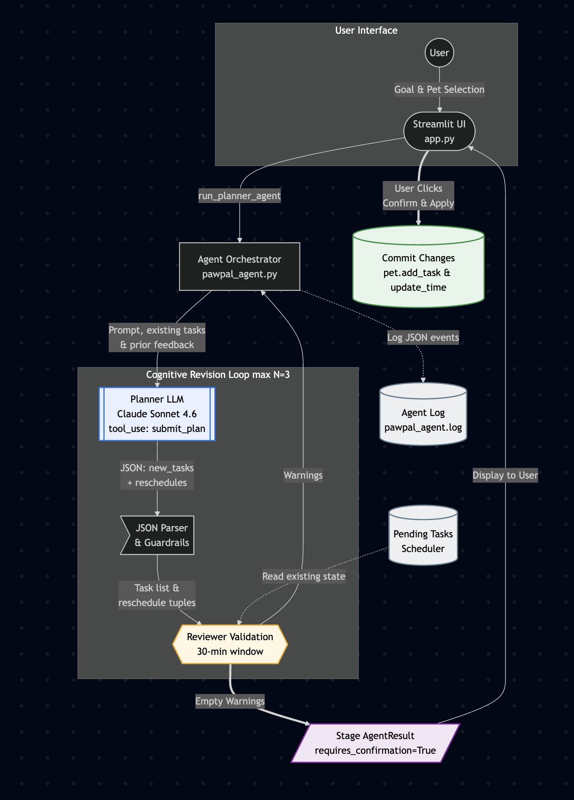

# 🐾 PawPal+ — Agentic Pet Care Planner

> **Applied AI System** · Final Capstone Project

---

## 📌 Original Project

This project extends my **Module 2 mini-project, PawPal+** — a Streamlit-based pet care task tracker. The original app let a pet owner register pets, manually create care tasks (walks, feedings, medications, appointments), and view a prioritized daily schedule with conflict detection. All scheduling was algorithmic — sorting by time or priority, flagging tasks within a 30-minute window, and auto-generating recurring tasks via `timedelta`. Every single task had to be entered by hand.

---

## 🎯 Title & Summary

**PawPal+** is an **AI-powered pet care planning assistant** that transforms a simple one-line care goal (e.g. *"Help my senior dog lose weight"*) into a complete, conflict-free, 7-day schedule of tasks — automatically.

### Why it matters

Pet owners often know *what* they want for their pet (weight loss, potty training, post-surgery recovery) but not *how* to structure a daily routine to achieve it. PawPal+ bridges that gap by combining an **AI Planner** (Google Gemini) with a **deterministic Reviewer** (Python conflict checker) in an agentic loop that drafts, validates, revises, and stages a plan — all before the owner clicks "Confirm."

### Key capabilities

| Feature | Description |
|---|---|
| **Manual Task Management** | Add, remove, complete tasks with auto-priority inference and recurrence |
| **AI Planner (Agentic)** | Natural-language goal → structured 7-day plan via Gemini function calling |
| **Plan → Review → Revise Loop** | Deterministic conflict checker validates AI proposals and feeds back warnings |
| **Human-in-the-Loop** | Plans are staged for review — nothing is applied until the user confirms |
| **Guardrails** | Input validation, banned-token denylist, bounded iterations, structured logging |
| **Reliability Eval** | 6-case automated eval harness + 16 offline unit tests |

---

## 🏗️ Architecture Overview



> Mermaid source in [`assets/architecture.mmd`](assets/architecture.mmd).

The system follows an **agentic Planner → Reviewer → Revise** architecture:

1. **User** enters a high-level care goal and selects a pet in the Streamlit UI (`app.py`).
2. **Agent Orchestrator** (`pawpal_agent.py`) builds a prompt with the pet profile, existing tasks, and any prior reviewer feedback, then calls the **Planner LLM** (Google Gemini `gemini-2.5-flash`).
3. **Planner LLM** returns structured JSON via a `submit_plan` function call (enforced by `FunctionCallingConfig(mode="ANY")`), proposing new tasks and/or reschedules.
4. **JSON Parser & Guardrails** validates the response: checks categories, frequencies, time format, day offsets, and clips past-time proposals to tomorrow.
5. **Reviewer** (`Scheduler.validate_proposed_changes`) — a deterministic Python function — checks the proposed plan against the owner's existing schedule for 30-minute conflicts. Pre-existing user conflicts are ignored.
6. **If conflicts exist**, the human-readable warning strings are fed back into the next Planner call. The loop runs up to **3 iterations** (configurable).
7. **If clean**, the plan is **staged** as an `AgentResult` and displayed in the UI for user review.
8. **User clicks Confirm & Apply** → `commit_agent_result` adds tasks to the pet.
9. **Agent Logging** (`agent_logging.py`) records every event as JSON lines to `pawpal_agent.log`.

### File structure

```
├── app.py                  # Streamlit UI (all sections)
├── pawpal_system.py        # Core classes: Owner, Pet, Task, Scheduler
├── pawpal_agent.py         # AI Planner agent (Gemini function calling)
├── agent_logging.py        # JSON-line structured logger
├── eval_agent.py           # 6-case reliability eval harness
├── model_card.md           # AI reflection, guardrails, eval results
├── reflection.md           # Module 2 design reflection
├── requirements.txt        # Python dependencies
├── .env.example            # Environment variable template
├── assets/
│   ├── architecture.mmd    # Mermaid diagram source
│   └── architecture.png    # Rendered system diagram
└── tests/
    ├── test_pawpal.py      # 6 original scheduler tests
    └── test_agent.py       # 10 agent tests (offline, mocked)
```

---

## ⚙️ Setup Instructions

### Prerequisites
- Python 3.10+
- A [Google Gemini API key](https://aistudio.google.com/apikey) (free tier works, billing recommended)

### Step-by-step

```bash
# 1. Clone the repo
git clone https://github.com/Iamdk25/applied-ai-system-pawpal.git
cd applied-ai-system-pawpal

# 2. Create and activate a virtual environment
python -m venv .venv
source .venv/bin/activate        # macOS/Linux
# .venv\Scripts\activate          # Windows

# 3. Install dependencies
pip install -r requirements.txt

# 4. Configure your API key
cp .env.example .env
# Edit .env and paste your GEMINI_API_KEY

# 5. Run the app
streamlit run app.py

# 6. Run the test suite (no API key needed)
python -m pytest tests/ -v

# 7. (Optional) Run the live reliability eval
python eval_agent.py
```

---

## 💬 Sample Interactions

Below are three real examples demonstrating the AI Planner generating plans from natural-language goals.

### Example 1: Senior Dog Weight Loss

| | |
|---|---|
| **Goal** | *"Help my senior dog lose weight over the next week"* |
| **Pet** | Rex — Dog, age 10 |
| **Existing tasks** | 1 daily walk at 08:00 |
| **AI Output** | 3 new tasks added in **1 iteration**: reduced-portion feedings at 07:30 and 17:30, plus an extra afternoon walk at 16:00 |
| **Reasoning** | *"A weight loss plan for a senior dog requires controlled feeding portions and increased but gentle exercise. Two measured feedings replace free-feeding, and an additional low-intensity walk supplements the existing morning walk."* |
| **Reviewer** | ✅ Passed — no conflicts with the existing 08:00 walk |

### Example 2: Puppy Potty Training

| | |
|---|---|
| **Goal** | *"Potty train my 3-month-old puppy"* |
| **Pet** | Bean — Dog, age 0 |
| **Existing tasks** | (none) |
| **AI Output** | 11 new tasks added in **2 iterations**: frequent bathroom walks (07:00, 10:00, 13:00, 16:00, 19:00), meals (07:30, 12:00, 17:30), and a crate training session |
| **Reasoning** | *"Young puppies need frequent outdoor trips after meals, naps, and play. A 3-hour rotation ensures consistent reinforcement."* |
| **Reviewer** | Iteration 1 had 2 conflicts (meal and walk at same time) → Iteration 2 spaced them 30+ min apart ✅ |

### Example 3: New Kitten Socialization

| | |
|---|---|
| **Goal** | *"New kitten introduction and socialization plan"* |
| **Pet** | Tiny — Cat, age 0 |
| **Existing tasks** | (none) |
| **AI Output** | 9 new tasks in **1 iteration**: daily feedings, supervised play sessions, gentle handling exercises, and a vet introductory appointment |
| **Reasoning** | *"Socialization in the first weeks is critical for a kitten. A structured plan includes feeding times, short play and handling sessions, and an initial vet visit."* |
| **Reviewer** | ✅ Passed — clean schedule with no conflicts |

### Reasoning Trace (visible in the UI)

Each plan includes an expandable **"Agent reasoning trace"** showing:
- The LLM's stated reasoning for each iteration
- The proposed tasks (with day, time, category)
- Any reviewer warnings that triggered a revision
- Latency in milliseconds per iteration

---

## 🧠 Design Decisions

### 1. Why an agentic workflow (not just a chatbot)?

A simple chatbot would generate text suggestions the user has to manually enter. The agentic approach **generates structured data** (Task objects with concrete times) that can be validated programmatically and applied with one click. This is the difference between "advice" and "automation."

### 2. Why a deterministic Reviewer instead of a second LLM?

The Reviewer (`Scheduler.validate_proposed_changes`) is pure Python — no API calls, no latency, no cost, and 100% deterministic. A second LLM would add non-determinism, cost, and the risk of two models agreeing on a wrong answer. The deterministic Reviewer catches every conflict reliably and produces the same human-readable warnings the user already sees in the schedule.

### 3. Why function calling instead of free-text parsing?

Google Gemini's `FunctionCallingConfig(mode="ANY")` forces the model to return structured JSON matching our `submit_plan` schema. This eliminates fragile regex/JSON extraction from free text and makes the output predictable and parseable.

### 4. Why stage-then-confirm (human-in-the-loop)?

The agent never directly modifies the pet's schedule. Plans are **staged** and displayed for review. The user sees every proposed task, the reasoning, and any reviewer feedback before clicking "Confirm & Apply." This ensures the owner always has the final say.

### 5. Trade-offs

| Decision | Trade-off |
|---|---|
| **30-min conflict window** | Catches most real conflicts but may miss 5-min clashes or flag benign 25-min gaps |
| **Max 3 revision iterations** | Balances quality vs. API cost/latency — rarely needs more than 2 |
| **No persistence** | Tasks live in Streamlit session state; a restart loses everything (acceptable for a demo) |
| **Category-locked priorities** | Removes user error but prevents manual priority overrides |
| **Single-model architecture** | Simpler than multi-agent but limited to one LLM's reasoning quality |

---

## 🧪 Testing Summary

### Unit Tests: 16/16 ✅ (offline, no API key)

```bash
python -m pytest tests/ -v
# 16 passed in 0.03s
```

**Original scheduler tests** (`tests/test_pawpal.py`) — 6 tests:
- Task completion, chronological sorting, daily recurrence, exact-time conflict detection, no false positives

**Agent tests** (`tests/test_agent.py`) — 10 tests:

| Test | What it proves |
|---|---|
| `test_happy_path_first_iteration_passes` | Clean plan is staged but not applied until commit |
| `test_commit_applies_tasks_to_pet` | `commit_agent_result` actually adds tasks to the pet |
| `test_conflict_triggers_revision` | Conflict in round 1 → round 2 picks different time → passes |
| `test_max_iterations_exceeded_commits_nothing` | 3 failed rounds → nothing applied, error surfaced |
| `test_malformed_response_logged_then_retried` | Missing fields caught, logged, next iteration succeeds |
| `test_empty_goal_rejected_before_api_call` | Empty goal blocked with zero API calls |
| `test_abusive_input_rejected` | Prompt injection ("ignore previous") blocked by guardrail |
| `test_validate_finds_internal_proposed_conflicts` | Two proposed tasks 10 min apart are flagged |
| `test_validate_finds_external_conflict_with_existing` | Proposed task 5 min after existing one is flagged |
| `test_validate_ignores_pre_existing_user_conflicts` | Agent not blamed for user's own pre-existing collisions |

### Live Reliability Eval: 5/6 (83%) ✅

```bash
python eval_agent.py
```

| # | Result | Iterations | New Tasks | Goal |
|---|--------|-----------|-----------|------|
| 1 | ✅ PASS | 1 | 3 | Help my senior dog lose weight |
| 2 | ✅ PASS | 2 | 11 | Potty train my 3-month-old puppy |
| 3 | ✅ PASS | 1 | 3 | Manage anxiety for my cat |
| 4 | ❌ FAIL | 3 | 0 | Recovery routine after surgery |
| 5 | ✅ PASS | 3 | 7 | Senior cat dental care routine |
| 6 | ✅ PASS | 1 | 9 | New kitten socialization |

**What worked:** 5 of 6 goals produced conflict-free plans within 3 iterations. Function calling with `mode=ANY` was highly reliable — Gemini called `submit_plan` with valid structured input in almost every iteration.

**What didn't:** Case 4 (surgery recovery) failed because Gemini kept proposing tasks that conflicted with a pre-existing daily medication at 08:00. The Reviewer flagged each collision, but the model couldn't space tasks far enough within 3 attempts. The **local fallback planner** (deterministic, no API) was applied instead.

**What I learned:** The revision loop works — when the model gets concrete feedback like *"'Vitamins' (08:15 AM) and 'Heartworm Pill' (08:00 AM) are only 15 min apart"*, it usually adjusts in the next iteration. But some goals with dense existing schedules need more than 3 rounds.

---

## 🔍 Guardrails & Reliability

| Guardrail | Implementation |
|---|---|
| Goal length (5–500 chars) | `_validate_goal` in `pawpal_agent.py` |
| Banned-token denylist | Blocks "ignore previous", "system prompt", `<script>`, "drop table" |
| Max 30 new tasks, 10 reschedules | Enforced in function declaration schema |
| Category enum (4 values) | `feeding`, `walk`, `medication`, `appointment` — schema-enforced |
| Frequency enum (3 values) | `once`, `daily`, `weekly` — schema-enforced |
| Time format validation | Regex `^([01]\d|2[0-3]):[0-5]\d$` |
| Past-time clipping | `day_offset=0` at a past time → pushed to tomorrow |
| Bounded iterations (max 3) | Configurable via UI slider |
| Structured logging | JSON events to `pawpal_agent.log` for replay/audit |
| Local fallback planner | Deterministic plan when API is unavailable or quota-limited |

See [`model_card.md`](model_card.md) for the full reliability eval and AI reflection.

---

## 💡 Reflection

### What this project taught me about AI and problem-solving

**AI is best as augmentation, not replacement.** The original PawPal+ already had a working algorithmic scheduler — sorting, filtering, conflict detection, recurrence. I deliberately kept all of it. The AI agent is additive: it generates plans the user *could* have entered manually, and hands them off to the existing system to be checked by the same deterministic logic. The user always has the final say.

**Structure beats cleverness.** The most impactful design decision wasn't the LLM — it was forcing structured output via function calling and building a deterministic Reviewer. Free-text LLM responses would have required fragile parsing; a second LLM as Reviewer would have added cost and non-determinism. The deterministic Python function catches every conflict reliably, and its human-readable warnings double as feedback for the next LLM iteration.

**Testing AI systems requires different strategies.** Traditional unit tests work for the deterministic parts (parser, guardrails, reviewer). But the LLM's behavior is non-deterministic, so I used dependency injection to mock it for offline tests and a separate live eval harness for real API testing. The two approaches complement each other: offline tests guarantee the *code* works; live evals measure how well the *system* performs.

**Switching providers is easier with clean architecture.** I originally built this with the Anthropic Claude API and later switched to Google Gemini. Because the agent code was cleanly separated from the LLM call, the migration only required changing one function (`_planner_call`) and updating the response extraction. The Planner → Reviewer → Revise loop, the guardrails, the tests, and the UI all stayed the same.

### AI collaboration during this project

**Helpful suggestion:** AI tools caught a pre-existing test bug in `tests/test_pawpal.py` — the assertion `assert any("WARNING:" in w for w in warnings)` was checking for a substring the code never emitted. The test had been silently passing only because an earlier assertion was caught first. AI proposed updating it to match the actual format (`"exact overlap"`), which was correct.

**Flawed suggestion:** AI proposed making the Reviewer a second LLM call for a stronger "two-agent" narrative. I pushed back — the existing conflict checker is deterministic, free, and testable. A second LLM would add cost, latency, and a self-fulfilling-prophecy risk where two models agree on the same wrong answer.

---

## 📹 Demo Walkthrough

> 📹 **[Watch the full demo walkthrough on YouTube](https://youtu.be/hqP-bQ1PSgQ)**

---

## 📬 Submission Checklist

- [x] Code pushed to GitHub (public repo)
- [x] `README.md` with all required sections
- [x] `model_card.md` with reflection, guardrails, eval results
- [x] System architecture diagram in `/assets`
- [x] Multiple meaningful commits in history
- [x] 16/16 tests passing offline
- [x] 5/6 live eval cases passing (83%)
- [x] Demo video walkthrough link added above
